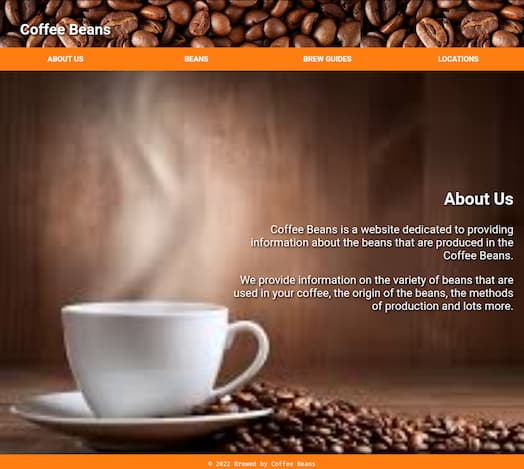

<div align = "center">

<h1><a href="https://2kabhishek.github.io/coffee-beans">coffee-beans</a></h1>

<a href="https://github.com/2KAbhishek/coffee-beans/blob/main/LICENSE">
 </a>

<a href="https://github.com/2KAbhishek/coffee-beans/graphs/contributors">
 </a>

<a href="https://github.com/2KAbhishek/coffee-beans/stargazers">
</a>

<a href="https://github.com/2KAbhishek/coffee-beans/network/members">
 </a>

<a href="https://github.com/2KAbhishek/coffee-beans/watchers">
 </a>

<a href="https://github.com/2KAbhishek/coffee-beans/pulse">
 </a>

<h3>Finest fictional coffee beans ☕🫘</h3>

<figure>
  
  <br/>
  <figcaption>coffee-beans screenshot</figcaption>
</figure>

</div>

## What is this

A website for a fictional coffee beans maker.

## Inspiration

Wanted to write some old skool `HTML`

## Prerequisites

Before you begin, ensure you have met the following requirements:

- You have installed the latest version of `any web browser`

## Getting coffee-beans

To get coffee-beans, follow these steps:

```bash
git clone https://github.com/2kabhishek/coffee-beans
cd coffee-beans
```

## Viewing coffee-beans

Open `index.html` in your favorite browser or visit [2kabhishek.github.io/coffee-beans](https://2kabhishek.github.io/coffee-beans).

## How it was built

coffee-beans was built using `VS Code`.

Hit the ⭐ button if you found this useful.

## More Info

<div align="center">

<a href="https://github.com/2KAbhishek/coffee-beans">Source</a> | <a href="https://2kabhishek.github.io/coffee-beans">Website</a>

</div>
